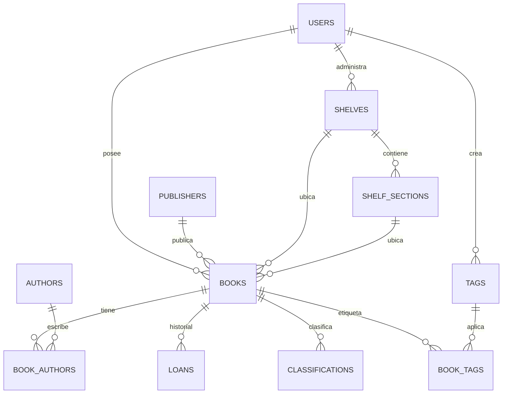

# Biblioteca personal PWA - arquitectura inicial

## 1. Esquema de base de datos

Base recomendada: PostgreSQL 16. El modelo separa entidades bibliograficas, ubicacion fisica, prestamos, usuarios y clasificaciones para que la app pueda crecer sin duplicar informacion.

```sql
CREATE EXTENSION IF NOT EXISTS pgcrypto;

CREATE TYPE availability_status AS ENUM ('EN_MI_BIBLIOTECA', 'PRESTADO');
CREATE TYPE reading_status AS ENUM ('SIN_ESTADO', 'LEIDO', 'POR_LEER');
CREATE TYPE loan_status AS ENUM ('ACTIVO', 'DEVUELTO');
CREATE TYPE image_source AS ENUM ('URL', 'LOCAL_UPLOAD', 'EXTERNAL_API');

CREATE TABLE users (
  id UUID PRIMARY KEY DEFAULT gen_random_uuid(),
  name TEXT NOT NULL,
  email TEXT NOT NULL UNIQUE,
  password_hash TEXT NOT NULL,
  created_at TIMESTAMPTZ NOT NULL DEFAULT now(),
  updated_at TIMESTAMPTZ NOT NULL DEFAULT now()
);

CREATE TABLE publishers (
  id UUID PRIMARY KEY DEFAULT gen_random_uuid(),
  name TEXT NOT NULL UNIQUE,
  created_at TIMESTAMPTZ NOT NULL DEFAULT now(),
  updated_at TIMESTAMPTZ NOT NULL DEFAULT now()
);

CREATE TABLE authors (
  id UUID PRIMARY KEY DEFAULT gen_random_uuid(),
  full_name TEXT NOT NULL,
  normalized_name TEXT NOT NULL,
  created_at TIMESTAMPTZ NOT NULL DEFAULT now(),
  updated_at TIMESTAMPTZ NOT NULL DEFAULT now(),
  UNIQUE (normalized_name)
);

CREATE TABLE shelves (
  id UUID PRIMARY KEY DEFAULT gen_random_uuid(),
  user_id UUID NOT NULL REFERENCES users(id) ON DELETE CASCADE,
  name TEXT NOT NULL,
  description TEXT,
  home_location TEXT NOT NULL,
  created_at TIMESTAMPTZ NOT NULL DEFAULT now(),
  updated_at TIMESTAMPTZ NOT NULL DEFAULT now(),
  UNIQUE (user_id, name)
);

CREATE TABLE shelf_sections (
  id UUID PRIMARY KEY DEFAULT gen_random_uuid(),
  shelf_id UUID NOT NULL REFERENCES shelves(id) ON DELETE CASCADE,
  name TEXT NOT NULL,
  position INTEGER NOT NULL,
  description TEXT,
  created_at TIMESTAMPTZ NOT NULL DEFAULT now(),
  updated_at TIMESTAMPTZ NOT NULL DEFAULT now(),
  UNIQUE (shelf_id, position)
);

CREATE TABLE books (
  id UUID PRIMARY KEY DEFAULT gen_random_uuid(),
  user_id UUID NOT NULL REFERENCES users(id) ON DELETE CASCADE,
  title TEXT NOT NULL,
  subtitle TEXT,
  isbn_10 VARCHAR(10),
  isbn_13 VARCHAR(13),
  publisher_id UUID REFERENCES publishers(id) ON DELETE SET NULL,
  publication_year INTEGER CHECK (publication_year IS NULL OR publication_year BETWEEN 0 AND 3000),
  page_count INTEGER CHECK (page_count IS NULL OR page_count > 0),
  genre TEXT,
  language_code VARCHAR(12),
  synopsis TEXT,
  edition TEXT,
  cover_url TEXT,
  cover_local_path TEXT,
  cover_source image_source,
  availability_status availability_status NOT NULL DEFAULT 'EN_MI_BIBLIOTECA',
  reading_status reading_status NOT NULL DEFAULT 'SIN_ESTADO',
  is_reference BOOLEAN NOT NULL DEFAULT false,
  shelf_id UUID REFERENCES shelves(id) ON DELETE SET NULL,
  shelf_section_id UUID REFERENCES shelf_sections(id) ON DELETE SET NULL,
  external_source TEXT,
  external_source_id TEXT,
  created_at TIMESTAMPTZ NOT NULL DEFAULT now(),
  updated_at TIMESTAMPTZ NOT NULL DEFAULT now(),
  deleted_at TIMESTAMPTZ,
  CONSTRAINT isbn_10_format CHECK (isbn_10 IS NULL OR isbn_10 ~ '^[0-9X]{10}$'),
  CONSTRAINT isbn_13_format CHECK (isbn_13 IS NULL OR isbn_13 ~ '^[0-9]{13}$')
);

CREATE UNIQUE INDEX books_user_isbn13_unique
  ON books(user_id, isbn_13)
  WHERE isbn_13 IS NOT NULL AND deleted_at IS NULL;

CREATE UNIQUE INDEX books_user_isbn10_unique
  ON books(user_id, isbn_10)
  WHERE isbn_10 IS NOT NULL AND deleted_at IS NULL;

CREATE INDEX books_search_idx ON books
USING GIN (
  to_tsvector('spanish',
    coalesce(title, '') || ' ' ||
    coalesce(subtitle, '') || ' ' ||
    coalesce(isbn_10, '') || ' ' ||
    coalesce(isbn_13, '') || ' ' ||
    coalesce(genre, '') || ' ' ||
    coalesce(synopsis, '')
  )
);

CREATE TABLE book_authors (
  book_id UUID NOT NULL REFERENCES books(id) ON DELETE CASCADE,
  author_id UUID NOT NULL REFERENCES authors(id) ON DELETE RESTRICT,
  author_order INTEGER NOT NULL DEFAULT 1,
  role TEXT NOT NULL DEFAULT 'autor',
  PRIMARY KEY (book_id, author_id)
);

CREATE TABLE tags (
  id UUID PRIMARY KEY DEFAULT gen_random_uuid(),
  user_id UUID NOT NULL REFERENCES users(id) ON DELETE CASCADE,
  name TEXT NOT NULL,
  color VARCHAR(24),
  created_at TIMESTAMPTZ NOT NULL DEFAULT now(),
  UNIQUE (user_id, name)
);

CREATE TABLE book_tags (
  book_id UUID NOT NULL REFERENCES books(id) ON DELETE CASCADE,
  tag_id UUID NOT NULL REFERENCES tags(id) ON DELETE CASCADE,
  PRIMARY KEY (book_id, tag_id)
);

CREATE TABLE loans (
  id UUID PRIMARY KEY DEFAULT gen_random_uuid(),
  book_id UUID NOT NULL REFERENCES books(id) ON DELETE CASCADE,
  borrower_name TEXT NOT NULL,
  borrower_contact TEXT,
  loaned_at DATE NOT NULL DEFAULT CURRENT_DATE,
  due_at DATE,
  returned_at DATE,
  notes TEXT,
  status loan_status NOT NULL DEFAULT 'ACTIVO',
  created_at TIMESTAMPTZ NOT NULL DEFAULT now(),
  updated_at TIMESTAMPTZ NOT NULL DEFAULT now()
);

CREATE UNIQUE INDEX one_active_loan_per_book
  ON loans(book_id)
  WHERE status = 'ACTIVO';

CREATE TABLE classifications (
  id UUID PRIMARY KEY DEFAULT gen_random_uuid(),
  book_id UUID NOT NULL REFERENCES books(id) ON DELETE CASCADE,
  dewey_code VARCHAR(32),
  dewey_hierarchy JSONB,
  dewey_explanation TEXT,
  lc_code VARCHAR(64),
  lc_hierarchy JSONB,
  lc_explanation TEXT,
  accepted BOOLEAN NOT NULL DEFAULT false,
  generated_by TEXT,
  generated_at TIMESTAMPTZ,
  created_at TIMESTAMPTZ NOT NULL DEFAULT now(),
  updated_at TIMESTAMPTZ NOT NULL DEFAULT now()
);

CREATE INDEX classifications_dewey_idx ON classifications(dewey_code);
CREATE INDEX classifications_lc_idx ON classifications(lc_code);

CREATE TABLE classification_suggestions (
  id UUID PRIMARY KEY DEFAULT gen_random_uuid(),
  book_id UUID NOT NULL REFERENCES books(id) ON DELETE CASCADE,
  request_payload JSONB NOT NULL,
  response_payload JSONB NOT NULL,
  provider TEXT NOT NULL,
  model TEXT NOT NULL,
  created_at TIMESTAMPTZ NOT NULL DEFAULT now()
);
```

### Relaciones principales



## 2. Arquitectura de la API

Stack recomendado: Node.js + Express + TypeScript + Prisma + PostgreSQL. La API sera REST; la documentacion OpenAPI/Swagger queda como siguiente mejora sobre el MVP funcional.

### Capas

- `routes`: define rutas HTTP y validacion inicial.
- `controllers`: traduce request/response.
- `services`: reglas de negocio, busqueda externa, clasificacion IA, prestamos.
- `repositories`: acceso a datos mediante Prisma.
- `integrations`: Open Library, Google Books, Anthropic, almacenamiento local.
- `middleware`: autenticacion JWT, manejo de errores, carga de archivos, rate limit.

### Principios de API

- Todas las rutas privadas requieren `Authorization: Bearer <token>`.
- Respuestas en JSON con fechas ISO 8601.
- Paginacion con `page`, `pageSize`, `sort`, `order`.
- Errores estandarizados:

```json
{
  "error": {
    "code": "BOOK_NOT_FOUND",
    "message": "No se encontro el libro solicitado",
    "details": {}
  }
}
```

## 3. Estructura de carpetas

```text
biblioteca/
  docker-compose.yml
  .env.example
  README.md
  docs/
    arquitectura-biblioteca-pwa.md
  apps/
    web/
      index.html
      vite.config.ts
      src/
        app/
        components/
        features/
          catalogo/
          escaneo/
          libros/
          estanterias/
          prestamos/
          clasificacion/
        hooks/
        lib/
        routes/
        styles/
        pwa/
    api/
      package.json
      prisma/
        schema.prisma
        migrations/
        seed.ts
      src/
        config/
        modules/
          auth/
          books/
          authors/
          publishers/
          shelves/
          loans/
          classifications/
          uploads/
          external-books/
        shared/
          middleware/
          errors/
          validation/
          openapi/
        server.ts
  storage/
    covers/
  scripts/
```

## 4. Dependencias principales

### Frontend

- `react`, `react-dom`: base de UI.
- `vite`: desarrollo rapido y build liviano.
- `typescript`: seguridad de tipos.
- `tailwindcss`: sistema visual consistente y responsive.
- `@tanstack/react-query`: cache y sincronizacion con API.
- `react-router-dom`: rutas de la PWA.
- `zod`: validacion de formularios y contratos.
- `react-hook-form`: formularios de ingreso y edicion.
- `@zxing/browser`: escaneo ISBN con camara en moviles y escritorio.
- `manifest.webmanifest` y service worker propio: modo instalable y cache basico sin depender de un plugin adicional.
- `lucide-react`: iconografia clara y ligera.

### Backend

- `express`: API REST.
- `typescript`, `tsx`: desarrollo tipado.
- `prisma`, `@prisma/client`: ORM y migraciones.
- `postgres`: base relacional.
- `zod`: validacion de entradas.
- `jsonwebtoken`, `bcryptjs`: autenticacion JWT.
- `multer`: subida local de portadas.
- `swagger-ui-express`, `openapi3-ts`: documentacion interactiva.
- `axios` o `undici`: clientes HTTP para Open Library, Google Books y Anthropic.
- `helmet`, `cors`, `express-rate-limit`: seguridad basica.
- Logs de proceso y errores estandarizados en el MVP; se puede sumar un logger estructurado en una fase posterior.

## 5. Endpoints de la API

### Autenticacion

| Metodo | Ruta | Descripcion |
|---|---|---|
| POST | `/api/auth/login` | Inicia sesion y devuelve JWT |
| POST | `/api/auth/register` | Crea el primer usuario o usuario familiar |
| GET | `/api/auth/me` | Devuelve el usuario autenticado |

Request:

```json
{
  "email": "casa@example.com",
  "password": "clave-segura"
}
```

Response:

```json
{
  "token": "jwt...",
  "user": {
    "id": "uuid",
    "name": "Biblioteca de casa",
    "email": "casa@example.com"
  }
}
```

### Busqueda externa y escaneo

| Metodo | Ruta | Descripcion |
|---|---|---|
| GET | `/api/external-books/isbn/:isbn` | Busca metadatos por ISBN en Open Library y Google Books como fallback |
| GET | `/api/external-books/search?q=` | Busca libros por titulo/autor |

Response:

```json
{
  "source": "open_library",
  "isbn13": "9780307474728",
  "title": "Cien anos de soledad",
  "authors": ["Gabriel Garcia Marquez"],
  "publisher": "Vintage Espanol",
  "publicationYear": 2009,
  "pageCount": 417,
  "genre": "Novela",
  "languageCode": "es",
  "synopsis": "...",
  "coverUrl": "https://..."
}
```

### Libros

| Metodo | Ruta | Descripcion |
|---|---|---|
| GET | `/api/books` | Lista, busca, filtra y ordena libros |
| POST | `/api/books` | Crea libro manualmente o desde datos escaneados |
| GET | `/api/books/:id` | Ficha completa |
| PATCH | `/api/books/:id` | Edita campos del libro |
| DELETE | `/api/books/:id` | Eliminacion logica |
| POST | `/api/books/:id/cover` | Sube o cambia portada |
| PATCH | `/api/books/:id/location` | Asigna estanteria y repisa |

Query de listado:

```text
/api/books?q=borges&availabilityStatus=EN_MI_BIBLIOTECA&readingStatus=LEIDO&genre=cuento&shelfId=uuid&sort=title&order=asc&page=1&pageSize=24
```

Request de creacion:

```json
{
  "title": "Ficciones",
  "authors": ["Jorge Luis Borges"],
  "isbn13": "9780307950925",
  "publisher": "Vintage",
  "publicationYear": 2012,
  "pageCount": 180,
  "genre": "Cuento",
  "languageCode": "es",
  "availabilityStatus": "EN_MI_BIBLIOTECA",
  "readingStatus": "POR_LEER",
  "isReference": false,
  "shelfId": "uuid",
  "shelfSectionId": "uuid"
}
```

Response:

```json
{
  "id": "uuid",
  "title": "Ficciones",
  "authors": [{"id": "uuid", "fullName": "Jorge Luis Borges"}],
  "availabilityStatus": "EN_MI_BIBLIOTECA",
  "readingStatus": "POR_LEER",
  "isReference": false,
  "location": {
    "shelf": "Estanteria sala",
    "section": "Repisa 2"
  }
}
```

### Estanterias y repisas

| Metodo | Ruta | Descripcion |
|---|---|---|
| GET | `/api/shelves` | Lista estanterias con conteo de libros |
| POST | `/api/shelves` | Crea estanteria |
| GET | `/api/shelves/:id` | Detalle con repisas y libros |
| PATCH | `/api/shelves/:id` | Edita estanteria |
| DELETE | `/api/shelves/:id` | Elimina, con reubicacion opcional |
| POST | `/api/shelves/:id/sections` | Crea repisa/seccion |
| PATCH | `/api/shelf-sections/:id` | Edita repisa |
| DELETE | `/api/shelf-sections/:id` | Elimina repisa |

Request de eliminacion con reubicacion:

```json
{
  "moveBooksToShelfId": "uuid",
  "moveBooksToSectionId": "uuid"
}
```

### Prestamos

| Metodo | Ruta | Descripcion |
|---|---|---|
| POST | `/api/books/:id/loans` | Registra prestamo |
| GET | `/api/loans?status=ACTIVO` | Lista prestamos |
| PATCH | `/api/loans/:id/return` | Marca devolucion |
| PATCH | `/api/loans/:id` | Edita datos del prestamo |

Request:

```json
{
  "borrowerName": "Laura",
  "borrowerContact": "laura@example.com",
  "loanedAt": "2026-06-06",
  "dueAt": "2026-07-06",
  "notes": "Prestado despues de la cena"
}
```

### Clasificacion

| Metodo | Ruta | Descripcion |
|---|---|---|
| POST | `/api/books/:id/classification/suggest` | Sugiere Dewey, LC y etiquetas |
| PATCH | `/api/books/:id/classification` | Acepta o modifica clasificacion |
| GET | `/api/classifications/search` | Filtra por Dewey, LC o etiqueta |

Request:

```json
{
  "title": "Ulysses",
  "authors": ["James Joyce"],
  "genre": "Novela",
  "synopsis": "Novela modernista ambientada en Dublin..."
}
```

Response:

```json
{
  "dewey": {
    "code": "823.912",
    "hierarchy": ["800 Literatura", "820 Literatura inglesa", "823 Ficcion inglesa"],
    "explanation": "Novela irlandesa en lengua inglesa del periodo modernista."
  },
  "lc": {
    "code": "PR6019.O9",
    "hierarchy": ["P Lengua y literatura", "PR Literatura inglesa", "PR6000-6049 Autores 1900-1960"],
    "explanation": "Signatura base usada para obras de James Joyce."
  },
  "tags": ["modernismo", "literatura irlandesa", "novela experimental"]
}
```

## 6. Pantallas principales

### Inicio / catalogo

Primera pantalla operativa, no landing page. Debe mostrar:

- Barra superior con busqueda global.
- Botones de accion: escanear ISBN, agregar manualmente, cambiar vista.
- Filtros laterales o panel inferior en movil: estado, genero, autor, editorial, estanteria, anio, idioma, Dewey, LC.
- Vista de cuadricula con portadas y estado visible.
- Vista de lista con titulo, autores, editorial, anio, ubicacion y estado.

### Detalle de libro

- Portada grande, titulo, autores, disponibilidad, estado de lectura y marca de referencia.
- Metadatos bibliograficos completos.
- Ubicacion fisica: estanteria y repisa.
- Prestamo activo, si existe, con boton de devolver.
- Clasificacion Dewey/LC y etiquetas.
- Acciones: editar, cambiar portada, prestar, eliminar.

### Ingreso por escaneo

- Vista de camara con marco de escaneo.
- Estado claro: buscando codigo, ISBN detectado, consultando metadatos.
- Pantalla de revision editable antes de guardar.
- Si falla la busqueda, conserva el ISBN y permite completar manualmente.

### Ingreso manual / edicion

- Formulario dividido en secciones: datos basicos, autores, publicacion, portada, ubicacion, estado, clasificacion.
- Titulo y al menos un autor son obligatorios.
- Portada por URL o subida local.
- Selector de estanteria y repisa.

### Gestion de estanterias

- Lista visual de estanterias con cantidad de libros.
- Detalle de estanteria con repisas y libros.
- Acciones para crear, editar, eliminar y reubicar.
- Vista tipo arbol: casa > ubicacion > estanteria > repisa > libros.

### Asistente de clasificacion

- Panel en la ficha o formulario de libro.
- Boton "Sugerir clasificacion".
- Resultado con Dewey, LC, etiquetas y explicacion breve.
- Acciones: aceptar, editar antes de guardar, ignorar.

## 7. Plan de implementacion por fases

### Fase 1 - MVP local

- Monorepo con frontend, backend y PostgreSQL.
- Autenticacion JWT simple.
- CRUD de libros, autores y editoriales.
- Ingreso manual.
- Catalogo con busqueda, filtros basicos, vista cuadricula/lista.
- Subida local de portadas.
- Docker Compose funcional.

### Fase 2 - Ubicacion fisica

- CRUD de estanterias y repisas.
- Asignacion de libro a estanteria/repisa.
- Vista de estanteria con libros.
- Reubicacion al eliminar estanteria.

### Fase 3 - Escaneo ISBN

- PWA instalable.
- Escaner con `@zxing/browser`.
- Consulta Open Library.
- Fallback a Google Books.
- Revision editable antes de guardar.

### Fase 4 - Prestamos

- Registro de prestamo.
- Disponibilidad automatica `PRESTADO`.
- Marcado de devolucion.
- Historial por libro y listado de prestamos activos.

### Fase 5 - Clasificacion inteligente

- Integracion con Anthropic.
- Prompt controlado con salida JSON.
- Guardado de sugerencias y clasificaciones aceptadas.
- Busqueda por Dewey, LC y etiquetas.

### Fase 6 - Pulido y despliegue

- Exportar/importar CSV.
- Backups de base de datos y portadas.
- Mejoras offline de PWA.
- Guia de despliegue en Railway, Render o VPS.

## 8. Docker Compose local

### Variables de entorno

```env
DATABASE_URL=postgresql://biblioteca:biblioteca@db:5432/biblioteca
JWT_SECRET=cambiar-esta-clave
ANTHROPIC_API_KEY=
GOOGLE_BOOKS_API_KEY=
UPLOAD_DIR=/app/storage/covers
API_PORT=4000
WEB_PORT=5173
```

### Compose propuesto

```yaml
services:
  db:
    image: postgres:16
    environment:
      POSTGRES_USER: biblioteca
      POSTGRES_PASSWORD: biblioteca
      POSTGRES_DB: biblioteca
    ports:
      - "5432:5432"
    volumes:
      - postgres_data:/var/lib/postgresql/data

  api:
    build:
      context: ./apps/api
    environment:
      DATABASE_URL: postgresql://biblioteca:biblioteca@db:5432/biblioteca
      JWT_SECRET: ${JWT_SECRET}
      ANTHROPIC_API_KEY: ${ANTHROPIC_API_KEY}
      GOOGLE_BOOKS_API_KEY: ${GOOGLE_BOOKS_API_KEY}
      UPLOAD_DIR: /app/storage/covers
    ports:
      - "4000:4000"
    volumes:
      - ./storage/covers:/app/storage/covers
    depends_on:
      - db

  web:
    build:
      context: ./apps/web
    environment:
      VITE_API_URL: http://localhost:4000/api
    ports:
      - "5173:5173"
    depends_on:
      - api

volumes:
  postgres_data:
```

### Comandos locales previstos

```bash
cp .env.example .env
docker compose up --build
```

Luego abrir:

- Frontend: `http://localhost:5173`
- API: `http://localhost:4000/api`
- Salud de API: `http://localhost:4000/api/health`

## 9. Notas de producto y seguridad

- Para uso familiar, JWT con usuarios simples es suficiente en el MVP.
- Las portadas deben guardarse con nombres generados, no con el nombre original del archivo.
- La clasificacion Dewey/LC sugerida por IA debe presentarse como recomendacion editable, no como verdad definitiva.
- Las APIs externas pueden devolver datos incompletos; el flujo de revision editable es obligatorio.
- Para iOS, el escaneo debe probarse desde HTTPS o entorno local compatible, porque la camara exige contexto seguro.
